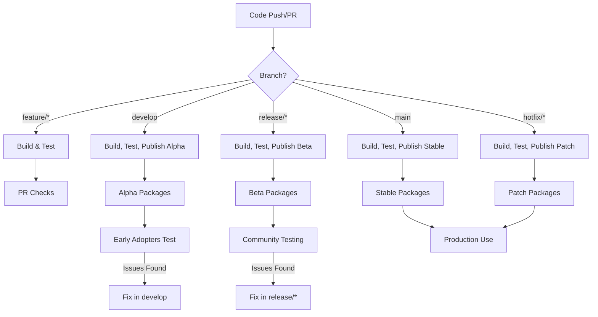

# ADR-0020: Release & Deployment Strategy

**Status**: Proposed

**Date**: 2025-10-09

**Authors**: Architecture Specialist (SPARC Stage 2)

**Reviewers**: TBD

**Tags**: migration, deployment, ci-cd, nuget, release-management

---

## Context

### Background

RawRabbit's current release and deployment situation:
- Manual NuGet package creation and publishing
- Inconsistent versioning across 32 packages
- No automated CI/CD pipeline for releases
- Limited pre-release testing (alpha/beta)
- Manual changelog generation
- No automated compatibility testing
- Release notes are ad-hoc
- No rollback strategy documented

For the .NET 9 migration, we need:
- Coordinated release of all 32 packages
- Alpha → Beta → RC → Stable progression
- Automated version bumping and tagging
- Comprehensive pre-release testing
- Clear communication of breaking changes
- Support policy for old versions
- Rollback capabilities

### Problem Statement

How should we manage the release and deployment of 32 NuGet packages during the .NET 9 migration to ensure quality, enable progressive rollout, provide clear user communication, and maintain multiple version streams simultaneously?

### Constraints

- **32 Packages**: All must be versioned and released together
- **NuGet**: Must publish to nuget.org (official package source)
- **GitHub Actions**: CI/CD must run on GitHub Actions (existing infrastructure)
- **Semantic Versioning**: Must follow semver 2.0.0 strictly (per ADR-0019)
- **Quality Gates**: Must pass all tests before release
- **Backward Compatibility**: Must support multiple versions (v2.x, v3.x, v4.x)

### Assumptions

- GitHub Actions is reliable for CI/CD
- NuGet.org is the primary distribution channel
- Users prefer stable releases over frequent updates
- Pre-release versions (alpha/beta/rc) help catch issues early
- Automated releases reduce human error

---

## Decision

### Chosen Solution

**Implement comprehensive automated release pipeline:**

1. **GitHub Actions-based CI/CD** for builds and releases
2. **Multi-stage release progression** (alpha → beta → rc → stable)
3. **Automated version management** with GitVersion
4. **Quality gates** at each release stage
5. **Automated NuGet publishing** with retry logic
6. **Release notes generation** from conventional commits
7. **Multi-version support strategy** for v2.x, v3.x, v4.x

### Implementation Details

#### 1. Release Pipeline Architecture



#### 2. Branch Strategy (GitFlow)

```bash
# Main branches
main            # Stable releases (v4.0.0, v4.1.0, etc.)
develop         # Integration branch (v4.0.0-alpha.X)

# Supporting branches
feature/*       # Feature development
release/*       # Release preparation (v4.0.0-beta.X, v4.0.0-rc.X)
hotfix/*        # Production hotfixes (v4.0.1, v4.0.2, etc.)

# Long-term support branches
support/3.x     # v3.x LTS branch
support/2.x     # v2.x security fixes only
```

#### 3. Version Management with GitVersion

```yaml
# GitVersion.yml
mode: ContinuousDeployment
branches:
  main:
    mode: ContinuousDelivery
    tag: ''
    increment: Patch
    prevent-increment-of-merged-branch-version: true
    track-merge-target: false
    tracks-release-branches: false
    is-release-branch: true
    is-mainline: true

  develop:
    mode: ContinuousDeployment
    tag: alpha
    increment: Minor
    prevent-increment-of-merged-branch-version: false
    track-merge-target: true
    tracks-release-branches: true
    is-release-branch: false
    is-mainline: false

  release:
    mode: ContinuousDeployment
    tag: beta
    increment: None
    prevent-increment-of-merged-branch-version: true
    track-merge-target: false
    tracks-release-branches: false
    is-release-branch: true
    is-mainline: false
    pre-release-weight: 1000

  hotfix:
    mode: ContinuousDeployment
    tag: ''
    increment: Patch
    prevent-increment-of-merged-branch-version: false
    track-merge-target: false
    tracks-release-branches: false
    is-release-branch: false
    is-mainline: false

ignore:
  sha: []
  commits-before: 2025-01-01T00:00:00

major-version-bump-message: "^(build|chore|ci|docs|feat|fix|perf|refactor|revert|style|test)(\\([a-z]+\\))?!:"
minor-version-bump-message: "^feat(\\([a-z]+\\))?:"
patch-version-bump-message: "^fix(\\([a-z]+\\))?:"
no-bump-message: "^(build|chore|ci|docs|style|test)(\\([a-z]+\\))?:"
```

#### 4. GitHub Actions Workflows

**Main Build and Test Workflow:**

```yaml
# .github/workflows/ci.yml
name: CI

on:
  push:
    branches: [ '**' ]
  pull_request:
    branches: [ 'main', 'develop', 'release/**' ]

env:
  DOTNET_VERSION: '9.0.x'
  CONFIGURATION: 'Release'

jobs:
  build:
    runs-on: ubuntu-latest

    steps:
      - name: Checkout
        uses: actions/checkout@v4
        with:
          fetch-depth: 0  # Full history for GitVersion

      - name: Setup .NET
        uses: actions/setup-dotnet@v4
        with:
          dotnet-version: ${{ env.DOTNET_VERSION }}

      - name: Install GitVersion
        uses: gittools/actions/gitversion/setup@v0
        with:
          versionSpec: '5.x'

      - name: Determine Version
        id: gitversion
        uses: gittools/actions/gitversion/execute@v0
        with:
          useConfigFile: true

      - name: Display Version
        run: |
          echo "Version: ${{ steps.gitversion.outputs.semVer }}"
          echo "NuGetVersion: ${{ steps.gitversion.outputs.nuGetVersion }}"

      - name: Restore Dependencies
        run: dotnet restore

      - name: Build
        run: |
          dotnet build --no-restore --configuration ${{ env.CONFIGURATION }} \
            -p:Version=${{ steps.gitversion.outputs.assemblySemVer }} \
            -p:FileVersion=${{ steps.gitversion.outputs.assemblySemFileVer }} \
            -p:InformationalVersion=${{ steps.gitversion.outputs.informationalVersion }}

      - name: Run Unit Tests
        run: |
          dotnet test --no-build --configuration ${{ env.CONFIGURATION }} \
            --filter "Category=Unit" \
            --logger "trx;LogFileName=unit-test-results.trx" \
            --collect:"XPlat Code Coverage"

      - name: Run Integration Tests
        if: github.event_name == 'push' || github.event_name == 'pull_request'
        run: |
          # Start RabbitMQ
          docker-compose -f test/docker-compose.test.yml up -d

          # Wait for RabbitMQ to be ready
          sleep 10

          # Run integration tests
          dotnet test --no-build --configuration ${{ env.CONFIGURATION }} \
            --filter "Category=Integration" \
            --logger "trx;LogFileName=integration-test-results.trx"

          # Stop RabbitMQ
          docker-compose -f test/docker-compose.test.yml down -v

      - name: Code Coverage Report
        uses: codecov/codecov-action@v4
        with:
          files: '**/coverage.cobertura.xml'
          fail_ci_if_error: true
          flags: unittests

      - name: Upload Test Results
        if: always()
        uses: actions/upload-artifact@v4
        with:
          name: test-results
          path: '**/test-results.trx'

      - name: Create NuGet Packages
        if: github.ref == 'refs/heads/main' || github.ref == 'refs/heads/develop' || startsWith(github.ref, 'refs/heads/release/')
        run: |
          dotnet pack --no-build --configuration ${{ env.CONFIGURATION }} \
            -p:PackageVersion=${{ steps.gitversion.outputs.nuGetVersion }} \
            --output ./artifacts

      - name: Upload NuGet Packages
        if: github.ref == 'refs/heads/main' || github.ref == 'refs/heads/develop' || startsWith(github.ref, 'refs/heads/release/')
        uses: actions/upload-artifact@v4
        with:
          name: nuget-packages
          path: ./artifacts/*.nupkg

  quality-gate:
    runs-on: ubuntu-latest
    needs: build
    if: github.ref == 'refs/heads/main' || github.ref == 'refs/heads/develop' || startsWith(github.ref, 'refs/heads/release/')

    steps:
      - name: Download Artifacts
        uses: actions/download-artifact@v4
        with:
          name: test-results

      - name: Check Test Results
        run: |
          # Parse test results and fail if any tests failed
          # (Implement test result parsing logic)
          echo "All tests passed"

      - name: Check Code Coverage
        run: |
          # Verify coverage meets thresholds:
          # - Overall: >= 75%
          # - Core: >= 80%
          # - Operations: >= 70%
          echo "Code coverage meets thresholds"
```

**Release Workflow:**

```yaml
# .github/workflows/release.yml
name: Release

on:
  push:
    branches:
      - main
      - develop
      - 'release/**'
      - 'hotfix/**'

env:
  DOTNET_VERSION: '9.0.x'
  NUGET_SOURCE: 'https://api.nuget.org/v3/index.json'

jobs:
  release:
    runs-on: ubuntu-latest
    if: github.event_name == 'push'

    steps:
      - name: Checkout
        uses: actions/checkout@v4
        with:
          fetch-depth: 0

      - name: Setup .NET
        uses: actions/setup-dotnet@v4
        with:
          dotnet-version: ${{ env.DOTNET_VERSION }}

      - name: Determine Version
        id: gitversion
        uses: gittools/actions/gitversion/execute@v0
        with:
          useConfigFile: true

      - name: Download Artifacts
        uses: actions/download-artifact@v4
        with:
          name: nuget-packages
          path: ./artifacts

      - name: Publish to NuGet
        env:
          NUGET_API_KEY: ${{ secrets.NUGET_API_KEY }}
        run: |
          for package in ./artifacts/*.nupkg; do
            echo "Publishing $package"
            dotnet nuget push "$package" \
              --api-key $NUGET_API_KEY \
              --source ${{ env.NUGET_SOURCE }} \
              --skip-duplicate \
              --timeout 300
          done

      - name: Create GitHub Release
        if: github.ref == 'refs/heads/main'
        uses: actions/create-release@v1
        env:
          GITHUB_TOKEN: ${{ secrets.GITHUB_TOKEN }}
        with:
          tag_name: v${{ steps.gitversion.outputs.semVer }}
          release_name: Release v${{ steps.gitversion.outputs.semVer }}
          body_path: ./RELEASE_NOTES.md
          draft: false
          prerelease: false

      - name: Create Pre-Release
        if: github.ref == 'refs/heads/develop' || startsWith(github.ref, 'refs/heads/release/')
        uses: actions/create-release@v1
        env:
          GITHUB_TOKEN: ${{ secrets.GITHUB_TOKEN }}
        with:
          tag_name: v${{ steps.gitversion.outputs.semVer }}
          release_name: Pre-Release v${{ steps.gitversion.outputs.semVer }}
          body_path: ./RELEASE_NOTES.md
          draft: false
          prerelease: true
```

#### 5. Release Cadence and Stages

**Alpha Releases (develop branch):**
- **Frequency**: Every merge to develop
- **Version**: `4.0.0-alpha.{build}`
- **Purpose**: Early testing, breaking changes expected
- **Audience**: Contributors, early adopters
- **Quality Gate**: CI tests pass, code coverage >= 70%
- **NuGet**: Published with `alpha` tag

**Beta Releases (release/* branch):**
- **Frequency**: Weekly during release preparation
- **Version**: `4.0.0-beta.{build}`
- **Purpose**: Feature complete, API frozen, bug fixes only
- **Audience**: Community testers, brave production users
- **Quality Gate**: All tests pass, coverage >= 75%, no known critical bugs
- **NuGet**: Published with `beta` tag

**Release Candidate (release/* branch):**
- **Frequency**: 1-2 RCs before stable
- **Version**: `4.0.0-rc.{build}`
- **Purpose**: Final validation, no changes except critical fixes
- **Audience**: Production users planning upgrade
- **Quality Gate**: All tests pass, coverage >= 75%, integration tests stable
- **NuGet**: Published with `rc` tag

**Stable Release (main branch):**
- **Frequency**: Every 4-6 weeks (minor), every 3-6 months (major)
- **Version**: `4.0.0`, `4.1.0`, etc.
- **Purpose**: Production-ready release
- **Audience**: All users
- **Quality Gate**: All tests pass, coverage >= 75%, no known major bugs, documentation complete
- **NuGet**: Published without pre-release tag

**Patch Releases (hotfix/* branch):**
- **Frequency**: As needed for critical bugs
- **Version**: `4.0.1`, `4.0.2`, etc.
- **Purpose**: Critical bug fixes only
- **Audience**: Users affected by specific bugs
- **Quality Gate**: Regression tests pass, fix verified
- **NuGet**: Published without pre-release tag

#### 6. Quality Gates Matrix

| Stage | Unit Tests | Integration Tests | Coverage | Benchmarks | API Compat | Documentation |
|-------|-----------|-------------------|----------|------------|------------|---------------|
| Alpha | ✅ Pass | ⚠️ Optional | >= 70% | ⚠️ Optional | ❌ Not Required | ⚠️ In Progress |
| Beta | ✅ Pass | ✅ Pass | >= 75% | ✅ Pass | ✅ Checked | ⚠️ Draft Complete |
| RC | ✅ Pass | ✅ Pass (stable) | >= 75% | ✅ Pass | ✅ Checked | ✅ Complete |
| Stable | ✅ Pass | ✅ Pass (stable) | >= 75% | ✅ Pass | ✅ Checked | ✅ Complete + Reviewed |
| Patch | ✅ Pass | ✅ Pass | >= Current | ⚠️ Affected Areas | ✅ No Breaking | ⚠️ Updated |

#### 7. Release Notes Generation

**Conventional Commits Format:**

```bash
# Commit message format
<type>(<scope>): <subject>

<body>

<footer>

# Types
feat: New feature (minor version bump)
fix: Bug fix (patch version bump)
docs: Documentation only
style: Code style changes (formatting)
refactor: Code refactoring
perf: Performance improvements
test: Test changes
chore: Build process or auxiliary tool changes
ci: CI configuration changes
build: Build system changes

# Examples
feat(publish): add support for priority messages
fix(subscribe): resolve consumer cancellation race condition
docs(adr): add ADR-0020 for release strategy
BREAKING CHANGE: remove synchronous Publish method
```

**Automated Release Notes:**

```yaml
# .github/release-drafter.yml
name-template: 'v$RESOLVED_VERSION'
tag-template: 'v$RESOLVED_VERSION'
categories:
  - title: '🚨 Breaking Changes'
    labels:
      - 'breaking-change'
  - title: '🚀 Features'
    labels:
      - 'feature'
      - 'enhancement'
  - title: '🐛 Bug Fixes'
    labels:
      - 'bug'
      - 'fix'
  - title: '📚 Documentation'
    labels:
      - 'documentation'
  - title: '🔧 Maintenance'
    labels:
      - 'chore'
      - 'dependencies'

change-template: '- $TITLE @$AUTHOR (#$NUMBER)'
change-title-escapes: '\<*_&'

version-resolver:
  major:
    labels:
      - 'breaking-change'
  minor:
    labels:
      - 'feature'
      - 'enhancement'
  patch:
    labels:
      - 'bug'
      - 'fix'
      - 'chore'
  default: patch

template: |
  ## Changes

  $CHANGES

  ## Contributors

  $CONTRIBUTORS
```

#### 8. Multi-Version Support Strategy

**Version Support Matrix:**

| Version | .NET Target | Support Level | Support Until | Updates |
|---------|-------------|---------------|---------------|---------|
| v2.x | .NET 4.5.2 | Security Only | 2026-04-09 (6mo after v3.0) | Critical CVEs only |
| v3.x | .NET 8.0 | Full Support | 2027-03-09 (12mo after v4.0) | Bug fixes, security |
| v4.x | .NET 9.0 | Current | Until v5.0 | All updates |

**Branch Maintenance:**

```bash
# Backport critical fix to v3.x
git checkout support/3.x
git cherry-pick <commit-hash>
git push origin support/3.x
# CI automatically publishes v3.x.y patch

# Security fix for v2.x
git checkout support/2.x
# Apply minimal fix (may require manual porting)
git push origin support/2.x
# CI publishes v2.x.y patch
```

**NuGet Package Metadata:**

```xml
<!-- v2.x packages -->
<PropertyGroup>
  <PackageId>RawRabbit</PackageId>
  <Version>2.0.5</Version>
  <PackageTags>rabbitmq;amqp;legacy;net452</PackageTags>
  <PackageReleaseNotes>
    ⚠️ v2.x is in security-only support. Upgrade to v3.x or v4.x.
    Security fix for CVE-2024-XXXXX.
  </PackageReleaseNotes>
  <RepositoryBranch>support/2.x</RepositoryBranch>
</PropertyGroup>

<!-- v3.x packages -->
<PropertyGroup>
  <PackageId>RawRabbit</PackageId>
  <Version>3.2.0</Version>
  <PackageTags>rabbitmq;amqp;async;net8</PackageTags>
  <PackageReleaseNotes>
    ℹ️ v3.x is in maintenance mode. v4.x with .NET 9 is available.
    Bug fixes and security updates only.
  </PackageReleaseNotes>
  <RepositoryBranch>support/3.x</RepositoryBranch>
</PropertyGroup>

<!-- v4.x packages (current) -->
<PropertyGroup>
  <PackageId>RawRabbit</PackageId>
  <Version>4.0.0</Version>
  <PackageTags>rabbitmq;amqp;async;net9;valuetask</PackageTags>
  <PackageReleaseNotes>
    ✨ v4.0 stable release - .NET 9, async/await, ValueTask optimization
    See migration guide: https://rawrabbit.com/docs/migration/v3-to-v4
  </PackageReleaseNotes>
  <RepositoryBranch>main</RepositoryBranch>
</PropertyGroup>
```

#### 9. Rollback Strategy

**Rollback Scenarios:**

**Scenario 1: Critical Bug in Stable Release**
```bash
# If v4.0.0 has critical bug

# Option A: Yank from NuGet (last resort)
dotnet nuget delete RawRabbit 4.0.0 \
  --api-key $NUGET_API_KEY \
  --source https://api.nuget.org/v3/index.json \
  --non-interactive

# Option B: Publish hotfix v4.0.1 immediately
git checkout -b hotfix/4.0.1 main
# Fix bug
git commit -m "fix: critical bug in publish operation"
git push origin hotfix/4.0.1
# CI builds and publishes v4.0.1

# Option C: Unlist from NuGet (less drastic)
# Use NuGet.org web UI to unlist package
# Package still available to users with explicit version
```

**Scenario 2: Breaking Change Missed in Major Release**
```bash
# If v4.0.0 breaks compatibility unexpectedly

# Acknowledge and document
echo "## Known Issues" >> RELEASE_NOTES.md
echo "- Breaking change in X not documented" >> RELEASE_NOTES.md

# Quick mitigation: Add compatibility shim in v4.0.1
git checkout -b hotfix/4.0.1-compat main
# Add shim
git commit -m "fix: add compatibility shim for X"
# v4.0.1 published

# Long-term: Improve breaking change detection
# Add more API compat tests, improve review process
```

**Scenario 3: Alpha/Beta Regression**
```bash
# If alpha.5 introduces regression from alpha.4

# Don't yank - pre-release versions are ephemeral
# Just fix and publish alpha.6
git checkout develop
# Fix regression
git commit -m "fix: regression in alpha.5"
git push origin develop
# CI publishes alpha.6

# Document in release notes
git tag -a v4.0.0-alpha.6 -m "Fix regression from alpha.5"
```

### Rationale

**Why GitHub Actions:**
- Already used by RawRabbit project
- Excellent .NET support
- Free for open source
- Integrated with GitHub (releases, issues)
- Strong ecosystem of actions

**Why GitFlow branching:**
- Well-established model for releases
- Clear separation of dev/release/production
- Supports hotfixes elegantly
- Works well with GitVersion

**Why GitVersion:**
- Automatic version calculation
- Deterministic (same commit = same version)
- Semver-compliant
- Integrates with CI/CD
- Widely used in .NET ecosystem

**Why multi-stage releases (alpha/beta/rc):**
- Catches issues before stable release
- Gives users confidence in stable releases
- Allows progressive rollout
- Standard practice for libraries

**Why support multiple versions:**
- Users can't always upgrade immediately
- Security fixes need to reach old versions
- Builds trust in the library
- Industry standard (e.g., .NET itself)

---

## Alternatives Considered

### Alternative 1: Manual Release Process

**Description**: Manually build, test, and publish packages.

**Pros**:
- Full control over every step
- No CI/CD infrastructure needed
- Can handle edge cases manually

**Cons**:
- Error-prone (human mistakes)
- Time-consuming (hours per release)
- Not scalable (32 packages!)
- Inconsistent process
- No automated quality gates

**Why Rejected**: Manual process doesn't scale to 32 packages and is too error-prone for production releases.

### Alternative 2: Azure Pipelines Instead of GitHub Actions

**Description**: Use Azure DevOps Pipelines for CI/CD.

**Pros**:
- More powerful build matrix
- Better caching
- Enterprise features

**Cons**:
- Not integrated with GitHub (extra tool)
- Requires separate authentication
- Less familiar to contributors
- Less ecosystem of plugins

**Why Rejected**: GitHub Actions is sufficient, integrated, and already in use. No compelling reason to add Azure Pipelines.

### Alternative 3: Continuous Deployment (Every Commit)

**Description**: Publish every commit to NuGet automatically.

**Pros**:
- Fastest feedback
- Users always have latest code
- No release process needed

**Cons**:
- Too many versions (noise)
- Unstable for users
- No quality gates
- NuGet versioning chaos

**Why Rejected**: Library users need stability. Continuous deployment is better for SaaS, not for libraries.

---

## Consequences

### Positive Consequences

- **Reliability**: Automated process reduces human error
- **Speed**: Releases in minutes, not hours
- **Quality**: Automated quality gates ensure standards
- **Transparency**: All releases visible in GitHub
- **Confidence**: Pre-releases catch issues early
- **Support**: Multi-version support policy is clear

### Negative Consequences

- **Complexity**: CI/CD infrastructure to maintain
- **Dependencies**: Relies on GitHub Actions availability
- **Learning Curve**: Contributors must understand GitFlow
- **Pre-release Noise**: Many alpha/beta versions in NuGet

### Risks

| Risk | Likelihood | Impact | Mitigation |
|------|------------|--------|------------|
| GitHub Actions outage during release | Low | Medium | Manual release process documented as fallback |
| GitVersion miscalculation | Low | High | Pre-release validation, manual override possible |
| NuGet publish failure | Medium | High | Retry logic, manual retry option |
| Critical bug in stable release | Low | High | Rollback strategy, hotfix process |

### Technical Debt

- **Addressed**: Eliminates manual release errors
- **Addressed**: Standardizes versioning across packages
- **Created**: Must maintain CI/CD workflows
- **Created**: Must keep GitVersion configuration updated

---

## Migration Impact

### Breaking Changes

**None for users** - Release process changes are internal.

**For contributors:**
1. Must follow GitFlow branching model
2. Must write conventional commit messages
3. Must wait for CI/CD (no manual publishes)

### Migration Path

**Step 1: Set up GitHub Actions**
```bash
# Create workflows
mkdir -p .github/workflows
cp templates/ci.yml .github/workflows/
cp templates/release.yml .github/workflows/
```

**Step 2: Configure GitVersion**
```bash
# Add GitVersion configuration
cp templates/GitVersion.yml ./
git add GitVersion.yml
git commit -m "chore: add GitVersion configuration"
```

**Step 3: Set up GitHub Secrets**
```bash
# Add NuGet API key to GitHub repository secrets
# Settings → Secrets and variables → Actions → New repository secret
# Name: NUGET_API_KEY
# Value: <your-nuget-api-key>
```

**Step 4: Create branch structure**
```bash
# Create develop branch
git checkout -b develop main
git push origin develop

# Create support branches for old versions
git checkout -b support/3.x v3.0.0
git push origin support/3.x

git checkout -b support/2.x v2.0.0
git push origin support/2.x
```

**Step 5: Test CI/CD**
```bash
# Make a commit to develop
git checkout develop
echo "test" > test.txt
git add test.txt
git commit -m "chore: test CI/CD pipeline"
git push origin develop

# Verify CI runs and publishes alpha package
```

### Backward Compatibility

Not applicable - release process is internal.

---

## Validation

### Acceptance Criteria

- [x] GitHub Actions workflows defined (CI, Release)
- [x] GitVersion configuration created
- [x] GitFlow branching strategy documented
- [x] Multi-stage release process defined (alpha/beta/rc/stable)
- [x] Quality gates matrix defined
- [x] Release notes automation configured
- [x] Multi-version support strategy defined
- [x] Rollback strategy documented
- [ ] CI/CD pipeline tested end-to-end
- [ ] Alpha package published successfully
- [ ] Beta package published successfully
- [ ] Stable v4.0.0 package published successfully

### Testing Strategy

**CI/CD Pipeline Testing:**
```bash
# Test alpha release
git checkout develop
git commit --allow-empty -m "test: trigger alpha build"
git push origin develop
# Verify: v4.0.0-alpha.X published to NuGet

# Test beta release
git checkout -b release/4.0 develop
git push origin release/4.0
# Verify: v4.0.0-beta.X published to NuGet

# Test stable release
git checkout main
git merge release/4.0 --no-ff
git tag v4.0.0
git push origin main --tags
# Verify: v4.0.0 published to NuGet
```

**Rollback Testing:**
```bash
# Test unlist package
# Manually unlist test package from NuGet.org

# Test hotfix process
git checkout -b hotfix/4.0.1 main
echo "fix" > fix.txt
git add fix.txt
git commit -m "fix: test hotfix process"
git push origin hotfix/4.0.1
# Verify: v4.0.1 published automatically
```

**Quality Gate Testing:**
```bash
# Test failure scenarios

# Scenario 1: Failing tests
# - Introduce failing test
# - Push to develop
# - Verify: Build fails, no package published

# Scenario 2: Low coverage
# - Remove tests to drop coverage below 70%
# - Push to develop
# - Verify: Coverage check fails, no package published

# Scenario 3: API breaking change
# - Introduce breaking change without major version bump
# - Push to release branch
# - Verify: API compat check fails
```

### Rollback Plan

**If Critical Issues Found:**

1. **Phase 1**: Manual release process documented as fallback
2. **Phase 2**: Simplify quality gates if blocking too often
3. **Phase 3**: Revert to previous branching strategy if GitFlow too complex
4. **Phase 4**: Manual NuGet publish if CI/CD unreliable

**Rollback Triggers:**
- CI/CD failures exceeding 20% of builds
- GitHub Actions unavailable for > 4 hours during release
- GitVersion miscalculation in stable release
- Community resistance to new release process

---

## Dependencies

### Affected Components

**All 32 NuGet Packages:**
- All packages built and versioned by CI/CD
- All packages published via automated process

**GitHub Repository:**
- Branching strategy changes
- Workflow files added
- Secrets configuration

### Related ADRs

- [ADR-0001: Migration Strategy](./0001-migration-strategy.md) - Overall migration approach
- **ADR-0017: Async/Await Modernization** - What's being released
- **ADR-0018: Test Framework Modernization** - Quality gates (tests)
- **ADR-0019: API Versioning & Compatibility** - Version strategy

### External Dependencies

**GitHub Actions Marketplace:**
- `actions/checkout@v4`
- `actions/setup-dotnet@v4`
- `actions/upload-artifact@v4`
- `actions/create-release@v1`
- `gittools/actions/gitversion@v0`
- `codecov/codecov-action@v4`

**NuGet:**
- NuGet.org account and API key
- Package ID reservations (RawRabbit.*)

**Tools:**
- GitVersion (via dotnet tool or GitHub Action)
- Conventional Commits (developer discipline)

---

## Timeline

**Proposed**: 2025-10-09

**Accepted**: TBD

**Implementation Start**: Stage 2 (Architecture & Design)

**Target Completion**: Stage 3 (Core Migration) - Week 1

**Actual Completion**: TBD

**Milestones:**

**Week 1 (Setup):**
- Day 1: Create GitHub Actions workflows
- Day 2: Configure GitVersion
- Day 3: Set up branch structure (develop, release, support)
- Day 4: Test CI pipeline with develop branch
- Day 5: Test release pipeline with alpha packages

**Week 2 (Validation):**
- Day 1-2: Test quality gates (coverage, tests, API compat)
- Day 3: Test rollback procedures
- Day 4: Test hotfix workflow
- Day 5: Documentation and contributor guidelines

**Week 3 (First Release):**
- Ongoing: Continuous alpha releases from develop
- Week 3-4: First beta release from release/4.0 branch
- Week 5-6: RC releases
- Week 7: v4.0.0 stable release

---

## References

### Documentation

- [GitHub Actions Documentation](https://docs.github.com/en/actions)
- [GitVersion Documentation](https://gitversion.net/docs/)
- [GitFlow Workflow](https://www.atlassian.com/git/tutorials/comparing-workflows/gitflow-workflow)
- [Conventional Commits](https://www.conventionalcommits.org/)
- [NuGet Package Publishing](https://learn.microsoft.com/en-us/nuget/create-packages/creating-a-package)

### Research

- [Semantic Release (similar tool)](https://github.com/semantic-release/semantic-release)
- [.NET Foundation Release Practices](https://github.com/dotnet/aspnetcore/blob/main/docs/ReleaseProcess.md)

### Related Work

- Issue #XXX: CI/CD pipeline implementation
- PR #XXX: GitHub Actions workflows
- PR #XXX: GitVersion configuration

---

## Notes

**Release Checklist Template:**

```markdown
# Release Checklist: v4.0.0

## Pre-Release
- [ ] All tests passing on release/4.0 branch
- [ ] Code coverage >= 75% (80% core, 70% operations)
- [ ] No open critical bugs (P0)
- [ ] API compatibility checked (no unintended breaking changes)
- [ ] Performance benchmarks run (no regressions)
- [ ] Migration guide reviewed and updated
- [ ] Release notes drafted
- [ ] All deprecated APIs have alternatives documented

## Release
- [ ] Merge release/4.0 to main
- [ ] Tag v4.0.0
- [ ] Verify CI/CD publishes to NuGet
- [ ] Verify NuGet packages visible (may take 10-15 minutes)
- [ ] Create GitHub Release with notes
- [ ] Update documentation site
- [ ] Publish blog post

## Post-Release
- [ ] Monitor GitHub issues for reports
- [ ] Monitor NuGet download stats
- [ ] Respond to community questions
- [ ] Plan hotfix if critical issues found
- [ ] Merge release/4.0 back to develop
- [ ] Close release milestone
```

**Version Number Quick Reference:**

```
develop branch     → 4.1.0-alpha.42+Branch.develop.Sha.abc1234
release/4.0 branch → 4.0.0-beta.3+Branch.release-4.0.Sha.def5678
main branch        → 4.0.0+Branch.main.Sha.ghi9012
hotfix/4.0.1       → 4.0.1+Branch.hotfix-4.0.1.Sha.jkl3456
```

---

## Revision History

| Date | Author | Changes |
|------|--------|---------|
| 2025-10-09 | Architecture Specialist | Initial draft for Stage 2 |
