# RawRabbit .NET 9 Migration Plan - Architecture Review

**Reviewer**: Migration Architect
**Date**: 2025-10-09
**Plan Version Reviewed**: 1.0

---

## Executive Summary

After analyzing the actual project structure and dependencies, the migration plan requires **significant refinements** in the following areas:

1. **Dependency order is partially incorrect** - MessageSequence has complex dependencies missed in the plan
2. **Timeline is optimistic** - 10-12 weeks is achievable but requires parallel execution
3. **Missing critical dependency analysis** - Several serialization libraries may be deprecated
4. **Multi-targeting decision needs immediate resolution** - Affects entire migration strategy
5. **Risk assessment incomplete** - Several breaking change categories not identified

**Recommendation**: Revise plan with corrected dependency graph before proceeding to Stage 2.

---

## 1. Technical Feasibility Assessment

### 1.1 Project Count Validation ✅

**Finding**: The plan correctly identifies **25 projects** in the solution.

**Breakdown**:
- Core library: 1 project
- Operations: 7 projects
- Enrichers: 12 projects (including 3 MessageContext variants)
- DI adapters: 3 projects
- Legacy compatibility: 1 project
- Sample applications: 3 projects
- Test projects: 4 projects (not mentioned in migration stages)

### 1.2 Timeline Analysis ⚠️

**10-12 weeks is achievable IF**:
- Parallel migration is executed properly (as planned)
- No .NET SDK installation delays (.NET SDK not currently installed on system)
- RabbitMQ.Client 7.x compatibility issues are minimal
- Test projects are migrated concurrently with source projects

**Risk Factors**:
- Stage 4 (Operations & Enrichers) is compressed - 14 projects in 2 weeks requires 7 parallel migrations
- No buffer time for unexpected API incompatibilities
- Test infrastructure setup (RabbitMQ Docker) not budgeted separately

**Recommendation**: Add 1-2 week buffer or extend Stage 4 to 3 weeks.

### 1.3 Framework Target Analysis

**Current State** (verified from .csproj files):
- Most projects: `netstandard1.5;net451`
- HttpContext enricher: `netstandard1.6;net451` (requires special handling)

**Migration Path Decision Required**:

#### Option A: Single Target (.NET 9) - RECOMMENDED
```xml
<TargetFrameworks>net9.0</TargetFrameworks>
```

**Pros**:
- Clean break, simpler migration
- Removes technical debt
- Enables .NET 9 specific optimizations
- Smaller package size

**Cons**:
- **Breaking change** - All consumers must upgrade to .NET 9
- No backward compatibility
- Requires coordinated migration for users

#### Option B: Multi-Target (.NET 9 + .NET Standard 2.1)
```xml
<TargetFrameworks>net9.0;netstandard2.1</TargetFrameworks>
```

**Pros**:
- Backward compatible with .NET Core 3.1+, .NET 5+, .NET Framework 4.7.2+
- Gradual user migration possible
- Wider ecosystem support during transition

**Cons**:
- Complex conditional compilation
- Must maintain two code paths
- Larger package size
- Delays .NET 9-specific optimizations
- .NET Standard 2.1 already obsolete (released 2019)

**Recommendation**:
**Option A (Single Target)** for the following reasons:
1. This is a major version upgrade (2.0 → 3.0 or 2.x → 9.0)
2. Current targets (.NET Standard 1.5, .NET Framework 4.5.1) are severely outdated
3. Clean architectural break allows better API modernization
4. RabbitMQ.Client 7.x likely requires modern runtime anyway

**Required ADR**: `docs/adr/0003-target-framework-selection.md` (already planned, good!)

---

## 2. Dependency Management - CRITICAL ISSUES

### 2.1 Corrected Component Migration Order

The plan's migration order in Stage 3-4 is **partially incorrect**. Here's the corrected dependency graph:

#### **Tier 0: Foundation (Week 3)**
No dependencies on other RawRabbit projects:
1. ✅ **RawRabbit** (Core) - Foundation for everything
2. ✅ **Configuration/Common** (if separate projects exist)

#### **Tier 1: Simple Operations & Enrichers (Week 3-4)**
Depends only on Core:
1. **RawRabbit.Operations.Publish** - Only depends on Core
2. **RawRabbit.Operations.Subscribe** - Only depends on Core
3. **RawRabbit.Operations.Get** - Only depends on Core
4. **RawRabbit.Enrichers.MessageContext** - Only depends on Core
5. **RawRabbit.Enrichers.Attributes** - Only depends on Core
6. **RawRabbit.Enrichers.GlobalExecutionId** - Only depends on Core
7. **RawRabbit.Enrichers.QueueSuffix** - Only depends on Core
8. **RawRabbit.Enrichers.Polly** - Depends on Core + Polly package
9. **RawRabbit.Enrichers.RetryLater** - Only depends on Core

#### **Tier 2: Composite Operations (Week 4-5)**
Depends on Tier 1 operations:
1. **RawRabbit.Operations.Request** - Only depends on Core (but conceptually pairs with Respond)
2. **RawRabbit.Operations.Respond** - Only depends on Core
3. **RawRabbit.Enrichers.MessageContext.Subscribe** - Depends on **Operations.Subscribe**
4. **RawRabbit.Enrichers.MessageContext.Respond** - Depends on **Operations.Respond**
5. **RawRabbit.Operations.StateMachine** - Depends on **Core + Operations.Subscribe + Stateless package**
6. **RawRabbit.Operations.Tools** - Only depends on Core

#### **Tier 3: Complex Integrations (Week 5-6)**
Depends on multiple Tier 1/2 components:

**CRITICAL FINDING**: `RawRabbit.Operations.MessageSequence` has the most complex dependency chain:
```xml
<ProjectReference Include="..\RawRabbit.Enrichers.GlobalExecutionId\..." />
<ProjectReference Include="..\RawRabbit.Operations.Publish\..." />
<ProjectReference Include="..\RawRabbit.Enrichers.MessageContext.Subscribe\..." />
<ProjectReference Include="..\RawRabbit.Operations.StateMachine\..." />
<ProjectReference Include="..\RawRabbit.Operations.Tools\..." />
```

**This means MessageSequence CANNOT be migrated until**:
- GlobalExecutionId (Tier 1)
- Operations.Publish (Tier 1)
- MessageContext.Subscribe (Tier 2)
- StateMachine (Tier 2)
- Operations.Tools (Tier 2)

**Plan Error**: The plan lists MessageSequence in Stage 4 Week 5-6 alongside basic operations, but should be in Tier 3/4 (Week 6).

#### **Tier 4: Framework Integration (Week 6-7)**
1. **RawRabbit.Enrichers.HttpContext** - Depends on Core + ASP.NET Core
2. **Serialization Enrichers** (can migrate in parallel):
   - Protobuf
   - MessagePack
   - ZeroFormatter

#### **Tier 5: DI Adapters (Week 7)**
1. **ServiceCollection** - Depends on Core + Microsoft.Extensions.DependencyInjection
2. **Autofac** - Depends on Core + Autofac package
3. **Ninject** - Depends on Core + Ninject package (verify active maintenance)

### 2.2 NuGet Package Compatibility Analysis

#### **Critical Dependencies**:

| Package | Current | Target | Status | Risk |
|---------|---------|--------|--------|------|
| RabbitMQ.Client | 5.0.1 | 7.x | ⚠️ High | Major version jump, API changes expected |
| Newtonsoft.Json | 10.0.1 | 13.x | ✅ Low | Well documented upgrade path |
| Polly | 5.3.1 | 8.x | ⚠️ Medium | API changes in v7+, async patterns changed |
| Stateless | 3.0.0 | 5.x | ⚠️ Low | Generally backward compatible |
| Microsoft.Extensions.DI | 1.0.2 | 9.x | ✅ Low | Well maintained, incremental changes |
| Microsoft.AspNetCore.Mvc.Core | 1.0.3 | 9.x | ⚠️ High | ASP.NET → ASP.NET Core migration required |

#### **Serialization Libraries** - HIGH RISK:

| Library | Current Target | Status | Recommendation |
|---------|---------------|--------|----------------|
| Protobuf-net | (not visible) | Active | Migrate, well-maintained |
| MessagePack | (not visible) | Active | Migrate, well-maintained |
| **ZeroFormatter** | Unknown | **⚠️ DEPRECATED** | **Consider removal** |

**CRITICAL**: ZeroFormatter was [archived in 2018](https://github.com/neuecc/ZeroFormatter) and does NOT support .NET Core 3.0+.

**Required Decision**:
- Option A: Drop ZeroFormatter enricher entirely (breaking change, document in ADR)
- Option B: Find fork/alternative (delays timeline)
- Option C: Mark as unsupported/deprecated in v3.0

**Required ADR**: `docs/adr/000X-zeroformatter-deprecation.md`

#### **DI Container Compatibility**:

| Container | .NET 9 Support | Action |
|-----------|----------------|--------|
| Microsoft.Extensions.DependencyInjection | ✅ Native | Migrate to v9.x |
| Autofac | ✅ Active (v8.x) | Update to latest |
| **Ninject** | ⚠️ **Last release 2017** | **Deprecate** |

**Required ADR**: `docs/adr/0007-di-adapter-support.md` (already planned, should include Ninject deprecation)

### 2.3 ASP.NET → ASP.NET Core Migration

**HttpContext Enricher** currently supports:
- `netstandard1.6` → Uses `Microsoft.AspNetCore.Mvc.Core 1.0.3`
- `net451` → Uses `System.Web` (classic ASP.NET)

**Migration Impact**:
1. Remove `net451` + `System.Web` code path entirely
2. Update to `Microsoft.AspNetCore.Http 9.x`
3. Change from `HttpContext.Current` (static) to injected `IHttpContextAccessor`
4. **Breaking change** - Classic ASP.NET no longer supported

**Required ADR**: `docs/adr/000X-aspnet-core-migration.md`

---

## 3. Risk Assessment - Expanded

### 3.1 Newly Identified Risks

| Risk | Severity | Probability | Impact | Mitigation |
|------|----------|-------------|--------|------------|
| **ZeroFormatter deprecation** | High | 100% | Users lose serialization option | Deprecation notice, migration guide |
| **Ninject deprecation** | Medium | 100% | Users must migrate DI | Provide Autofac/MS.DI migration guide |
| **RabbitMQ.Client 7.x breaking changes** | High | 80% | Core API refactoring needed | Early testing, compatibility shims |
| **ASP.NET Core 9.x API changes** | Medium | 50% | HttpContext enricher redesign | Review breaking changes docs |
| **Polly 8.x async patterns** | Medium | 70% | Retry logic refactoring | Review Polly migration guide |
| **MessageSequence dependency chain** | Low | 30% | Delayed Tier 3 migration | Correct migration order (already addressed) |
| **.NET SDK not installed** | Low | 100% | Cannot start development | Install before Stage 1 |
| **Test infrastructure** | Medium | 40% | Integration tests blocked | Docker RabbitMQ setup in Stage 1 |

### 3.2 Breaking Changes Categories Not in Plan

The plan mentions breaking changes but doesn't categorize them. Here's a comprehensive list:

#### **Confirmed Breaking Changes**:
1. **Target Framework**: .NET 4.5.1 → .NET 9 (if single-target)
2. **NuGet Dependencies**: RabbitMQ.Client 5.x → 7.x
3. **ASP.NET Classic**: Removed entirely (System.Web → ASP.NET Core)
4. **ZeroFormatter**: Likely deprecated/removed
5. **Ninject**: Adapter deprecated

#### **Potential Breaking Changes** (requires API review):
1. **RabbitMQ.Client API surface changes**
2. **Polly retry policy syntax** (v5 → v8)
3. **Reflection APIs** (if using .NET Framework-specific patterns)
4. **Cryptography APIs** (mentioned in plan, needs specifics)

**Required Deliverable**: `docs/BREAKING-CHANGES.md` comprehensive list (not mentioned in plan)

### 3.3 Missing Risk: Test Project Migration

The plan doesn't mention test project migration timeline:
- `RawRabbit.Tests` (unit tests)
- `RawRabbit.IntegrationTests` (requires RabbitMQ)
- `RawRabbit.Enrichers.Polly.Tests`
- `RawRabbit.PerformanceTest`

**Recommendation**: Migrate test projects **in parallel** with each component's migration (not as separate stage).

---

## 4. Architecture Decisions - Missing ADRs

The plan identifies 5-7 ADRs, but analysis reveals **10+ critical decisions** requiring documentation:

| ADR | Title | Priority | Stage |
|-----|-------|----------|-------|
| 0001 | Migration Strategy | High | 1 |
| 0002 | Security Architecture | High | 1 |
| 0003 | Target Framework Selection | **Critical** | 2 |
| 0004 | Dependency Update Strategy | High | 2 |
| 0005 | Security Review Results | High | 2 |
| 0006 | Core API Changes | Medium | 3 |
| 0007 | DI Adapter Support | High | 5 |
| **0008** | **ZeroFormatter Deprecation** | **High** | **2** |
| **0009** | **Ninject Deprecation** | **Medium** | **2** |
| **0010** | **ASP.NET Core Migration** | **High** | **2** |
| **0011** | **RabbitMQ.Client 7.x Compatibility** | **Critical** | **3** |
| **0012** | **JSON Serializer Strategy** | **Medium** | **3** |

### 4.1 Missing ADR: JSON Serializer Strategy

**Decision Required**: Newtonsoft.Json vs System.Text.Json

**Context**:
- Current: Newtonsoft.Json 10.0.1
- System.Text.Json is now mature (.NET 9 includes latest features)
- RawRabbit likely has JSON deeply integrated in serialization pipeline

**Options**:
1. **Update Newtonsoft.Json to 13.x** (conservative, backward compatible)
2. **Migrate to System.Text.Json** (modern, better performance, but breaking change)
3. **Support both** (abstraction layer, complex)

**Recommendation**:
- **Short-term (v3.0)**: Update to Newtonsoft.Json 13.x (minimize breaking changes)
- **Long-term (v4.0)**: Migrate to System.Text.Json with compatibility layer

**Required ADR**: `docs/adr/0012-json-serializer-strategy.md`

---

## 5. Migration Strategy Refinement

### 5.1 Revised Stage 3-4 Timeline

#### **Stage 3: Core & Tier 1 (Week 3-4.5)**

**Week 3**:
- RawRabbit (Core) - CRITICAL PATH
- Setup RabbitMQ Docker for testing
- Initial RabbitMQ.Client 7.x integration tests

**Week 3.5-4** (Parallel - 9 projects):
- Operations: Publish, Subscribe, Request, Respond, Get
- Enrichers: MessageContext, Attributes, GlobalExecutionId, QueueSuffix

**Week 4-4.5** (Parallel - 2 projects):
- Enrichers: Polly (requires Polly upgrade testing), RetryLater

#### **Stage 4: Tier 2-3 Operations (Week 4.5-6.5)**

**Week 4.5-5.5** (Parallel - 5 projects):
- MessageContext.Subscribe (depends on Operations.Subscribe)
- MessageContext.Respond (depends on Operations.Respond)
- Operations.StateMachine (depends on Subscribe + Stateless upgrade)
- Operations.Tools
- **BEGIN: MessageSequence** (longest dependency chain - needs extra time)

**Week 5.5-6** (Parallel - 4 projects):
- Serialization Enrichers: Protobuf, MessagePack
- **DECISION**: ZeroFormatter (deprecate or find alternative)
- HttpContext Enricher (ASP.NET Core migration)

**Week 6-6.5**:
- **COMPLETE: MessageSequence** (validate all dependencies)
- Final integration testing of all operations

### 5.2 Parallel Execution Strategy

**Recommended Agent Allocation** (matches plan's agent roles):

| Week | Migration Architect | .NET Modernizer | QA Engineer | Security Specialist |
|------|---------------------|-----------------|-------------|---------------------|
| 3 | Core architecture | Core implementation | Test infrastructure | Security baseline |
| 3.5-4 | Dependency coordination | 3-4 projects each | Test migration | Dependency scanning |
| 4.5-5.5 | MessageSequence planning | Tier 2 projects | Integration tests | Polly/StateMachine review |
| 5.5-6 | ADR finalization | Serialization + HttpContext | E2E test scenarios | ASP.NET Core security |

---

## 6. Specific Actionable Refinements

### 6.1 Immediate Actions (Before Stage 1 Start)

**Priority 1 - Blockers**:
1. ✅ Install .NET 9 SDK on development machine(s)
2. ✅ Create ADR template and directory structure (already planned)
3. ⚠️ **NEW**: Research RabbitMQ.Client 5.x → 7.x breaking changes
4. ⚠️ **NEW**: Verify ZeroFormatter .NET 9 compatibility (or plan deprecation)
5. ⚠️ **NEW**: Verify Ninject active maintenance status

**Priority 2 - Planning**:
1. Create corrected dependency graph diagram (visual representation)
2. Set up Docker Compose for RabbitMQ test environment
3. Create migration decision log template

### 6.2 Stage 1 Additions

**Add to Section 1.2 (Discovery & Analysis)**:
```markdown
- [ ] Analyze RabbitMQ.Client 7.x migration guide
- [ ] Test RabbitMQ.Client 7.x basic connection with .NET 9
- [ ] Verify ZeroFormatter .NET 9 compatibility
- [ ] Research Ninject .NET 9 support or alternatives
- [ ] Document deprecated API replacements for each dependency
- [ ] Create visual dependency graph for all 25 projects
- [ ] Analyze test project dependencies
```

**Add new deliverable**:
- `docs/dependency-graph.mermaid` or `.svg` - Visual dependency tree

### 6.3 Stage 2 Additions

**Add Decision Point 4**:
```markdown
4. **JSON Serialization Strategy**:
   - Option A: Update Newtonsoft.Json to 13.x (recommended for v3.0)
   - Option B: Migrate to System.Text.Json (consider for v4.0)
   - Option C: Support both with abstraction layer
```

**Add Decision Point 5**:
```markdown
5. **Deprecated Package Handling**:
   - ZeroFormatter: Deprecate or find fork
   - Ninject: Deprecate or verify .NET 9 compatibility
   - Document migration paths for affected users
```

**Add ADRs**:
- `docs/adr/0008-zeroformatter-deprecation.md`
- `docs/adr/0009-ninject-deprecation.md`
- `docs/adr/0010-aspnet-core-migration.md`
- `docs/adr/0011-rabbitmq-client-compatibility.md`
- `docs/adr/0012-json-serializer-strategy.md`

### 6.4 Stage 3 Corrections

**Revise 3.1 (Core Migration) to include**:
```markdown
**Week 3 - RawRabbit Core**:
1. Update to .NET 9
2. **RabbitMQ.Client 5.0.1 → 7.x migration**:
   - Review connection factory API changes
   - Update channel management for new async APIs
   - Test basic publish/subscribe with RabbitMQ.Client 7.x
   - Document all API changes in ADR 0011
3. **Newtonsoft.Json 10.0.1 → 13.x**:
   - Update package reference
   - Test serialization/deserialization
   - Verify no breaking changes in usage
4. Refactor deprecated .NET Framework APIs
5. Update SimpleDependencyInjection for .NET 9
```

**Add Week 3.5 - Test Infrastructure**:
```markdown
**Week 3.5 - Test Infrastructure Setup**:
- [ ] Docker Compose for RabbitMQ 3.12.x
- [ ] Docker Compose for RabbitMQ 3.11.x (compatibility testing)
- [ ] CI/CD pipeline integration
- [ ] Test data generation scripts
- [ ] Baseline performance benchmarks
```

### 6.5 Stage 4 Corrections

**Revise Operations Migration Order**:

```markdown
### 4.1 Operations Migration - Tier 1 (Week 3.5-4)

**Independent Operations** (migrate in parallel):
1. Publish
2. Subscribe
3. Request
4. Respond
5. Get
6. Tools

### 4.2 Operations Migration - Tier 2 (Week 4.5-5.5)

**Dependent Operations**:
1. StateMachine (depends on Subscribe + Stateless package)
2. MessageSequence (depends on: GlobalExecutionId, Publish, MessageContext.Subscribe, StateMachine, Tools)
   - **CRITICAL**: MessageSequence has longest dependency chain
   - Allocate extra time for integration testing
```

**Add ZeroFormatter Decision**:
```markdown
### 4.3 Serialization Enrichers - Special Handling (Week 5.5-6)

**Standard Enrichers**:
- Protobuf (verify latest version)
- MessagePack (verify latest version)

**Deprecated Enricher**:
- **ZeroFormatter**:
  - If deprecated: Create deprecation notice, update docs
  - If alternative found: Document in ADR 0008
  - If keeping: Verify fork maintenance and .NET 9 support
```

### 6.6 Stage 7 Additions

**Add to Documentation Completion**:
```markdown
- [ ] Create `docs/BREAKING-CHANGES.md` comprehensive list
- [ ] Create `docs/DEPRECATED.md` for ZeroFormatter/Ninject
- [ ] Update NuGet package descriptions with .NET 9 requirement
- [ ] Create upgrade guide with code examples
- [ ] Document RabbitMQ.Client API changes
- [ ] Create troubleshooting guide for common issues
```

---

## 7. Timeline Revision

### 7.1 Recommended Adjustments

**Original**: 10-12 weeks
**Recommended**: 11-13 weeks (add 1 week buffer)

**Revised Stage Durations**:
- Stage 1: 2 weeks (unchanged)
- Stage 2: 1.5 weeks (add 0.5 week for additional ADRs)
- Stage 3: 1.5 weeks (unchanged, but includes test infrastructure)
- Stage 4: 3 weeks (extend from 2 weeks due to MessageSequence complexity)
- Stage 5: 1 week (unchanged)
- Stage 6: 1.5 weeks (add 0.5 week for comprehensive integration testing)
- Stage 7: 1 week (unchanged)
- Stage 8: 2 weeks (unchanged)

**Total**: 13.5 weeks → Round to **12-14 weeks** with buffer

### 7.2 Critical Path Analysis

**Longest Dependency Chain**:
```
Core (Week 3)
  → Operations.Publish (Week 3.5-4)
  → Operations.Subscribe (Week 3.5-4)
  → GlobalExecutionId (Week 3.5-4)
  → Operations.StateMachine (Week 4.5-5) [depends on Subscribe]
  → MessageContext.Subscribe (Week 4.5-5) [depends on Subscribe]
  → Operations.Tools (Week 4.5-5)
  → MessageSequence (Week 5-6) [depends on ALL above]
```

**Critical Path Duration**: 3 weeks (Week 3 → Week 6)
**Total Project Duration**: 12-14 weeks
**Parallelization Efficiency**: 4.3x (54 weeks of work / 13 weeks calendar time)

---

## 8. Success Criteria Additions

### 8.1 New Technical Criteria

Add to existing list:
```markdown
- ✅ All deprecated dependencies removed or documented
- ✅ RabbitMQ.Client 7.x integration validated
- ✅ All test projects migrated and passing
- ✅ Performance benchmarks meet or exceed .NET Standard 1.5 baseline
- ✅ Docker test infrastructure documented and automated
- ✅ All ADRs reviewed and approved
```

### 8.2 New Documentation Criteria

Add:
```markdown
- ✅ `docs/BREAKING-CHANGES.md` published
- ✅ `docs/DEPRECATED.md` for sunset features
- ✅ Dependency graph visualization created
- ✅ RabbitMQ.Client upgrade guide included
- ✅ Troubleshooting guide created
```

---

## 9. Summary of Key Findings

### ✅ **Plan Strengths**:
1. Excellent multi-stage structure with clear milestones
2. Good agent allocation and role definition
3. Comprehensive documentation strategy (ADRs, history, test reports)
4. Security checkpoints throughout lifecycle
5. Phased rollout strategy (alpha → beta → RC → production)

### ⚠️ **Critical Issues Requiring Immediate Action**:
1. **MessageSequence dependency order incorrect** - Fix before Stage 3
2. **ZeroFormatter likely deprecated** - Decision needed in Stage 2
3. **Ninject maintenance status unclear** - Decision needed in Stage 2
4. **RabbitMQ.Client 7.x breaking changes unknown** - Research in Stage 1
5. **ASP.NET Core migration details missing** - Plan in Stage 2
6. **.NET SDK not installed** - Install before Stage 1

### 📋 **Additional Deliverables Required**:
- 5 additional ADRs (ZeroFormatter, Ninject, ASP.NET Core, RabbitMQ, JSON)
- `docs/BREAKING-CHANGES.md`
- `docs/DEPRECATED.md`
- `docs/dependency-graph.mermaid`
- Troubleshooting guide

### 📅 **Timeline Adjustment**:
- **Original**: 10-12 weeks
- **Recommended**: 12-14 weeks (add 2 weeks buffer)
- **Justification**: Additional ADR work, MessageSequence complexity, deprecation handling

---

## 10. Recommendation

**Approve plan with modifications**. The plan is fundamentally sound but requires:

1. ✅ **Adopt corrected dependency migration order** (Section 2.1)
2. ✅ **Extend timeline to 12-14 weeks** (Section 7.1)
3. ✅ **Add 5 critical ADRs** (Section 4)
4. ✅ **Research deprecated dependencies immediately** (Section 6.1)
5. ✅ **Install .NET 9 SDK before Stage 1** (Section 6.1)
6. ✅ **Add test project migration to component stages** (Section 3.3)

**Proceed to Stage 1 after**:
- .NET 9 SDK installation confirmed
- Corrected dependency order incorporated into plan
- Additional ADRs added to Stage 2 deliverables

---

## Appendix A: Visual Dependency Graph

```mermaid
graph TD
    Core[RawRabbit Core]

    %% Tier 1
    Pub[Operations.Publish]
    Sub[Operations.Subscribe]
    Req[Operations.Request]
    Res[Operations.Respond]
    Get[Operations.Get]
    Tools[Operations.Tools]

    MC[Enrichers.MessageContext]
    Attr[Enrichers.Attributes]
    ExecId[Enrichers.GlobalExecutionId]
    Queue[Enrichers.QueueSuffix]
    Polly[Enrichers.Polly]
    Retry[Enrichers.RetryLater]

    %% Tier 2
    MCSub[Enrichers.MessageContext.Subscribe]
    MCRes[Enrichers.MessageContext.Respond]
    SM[Operations.StateMachine]

    %% Tier 3
    MSeq[Operations.MessageSequence]

    %% Tier 4
    Http[Enrichers.HttpContext]
    Proto[Enrichers.Protobuf]
    MP[Enrichers.MessagePack]
    Zero[Enrichers.ZeroFormatter]

    %% Tier 5
    DI1[DI.ServiceCollection]
    DI2[DI.Autofac]
    DI3[DI.Ninject]

    Core --> Pub
    Core --> Sub
    Core --> Req
    Core --> Res
    Core --> Get
    Core --> Tools
    Core --> MC
    Core --> Attr
    Core --> ExecId
    Core --> Queue
    Core --> Polly
    Core --> Retry

    Sub --> MCSub
    Sub --> SM
    Res --> MCRes

    Pub --> MSeq
    ExecId --> MSeq
    MCSub --> MSeq
    SM --> MSeq
    Tools --> MSeq

    Core --> Http
    Core --> Proto
    Core --> MP
    Core --> Zero

    Core --> DI1
    Core --> DI2
    Core --> DI3

    style Core fill:#ff6b6b
    style MSeq fill:#ffd93d
    style Zero fill:#a8dadc,stroke:#e63946,stroke-width:3px
    style DI3 fill:#a8dadc,stroke:#e63946,stroke-width:3px
```



**Legend**:
- 🔴 Red: Critical path (Core)
- 🟡 Yellow: Complex dependencies (MessageSequence)
- 🔵 Dashed border: Potentially deprecated (ZeroFormatter, Ninject)

---

## Appendix B: Required Immediate Research

### B.1 RabbitMQ.Client 5.x → 7.x Migration

**Research Tasks**:
1. Review [RabbitMQ.Client 7.x release notes](https://github.com/rabbitmq/rabbitmq-dotnet-client/releases)
2. Identify breaking API changes in:
   - Connection factory
   - Channel management
   - Async/await patterns
   - Consumer interfaces
3. Test basic operations with .NET 9 + RabbitMQ.Client 7.x
4. Document compatibility issues

**Timeline**: Complete during Stage 1 Week 1

### B.2 ZeroFormatter Status

**Research Tasks**:
1. Verify [ZeroFormatter repository](https://github.com/neuecc/ZeroFormatter) status
2. Search for active forks supporting .NET 9
3. Evaluate alternatives (MemoryPack, etc.)
4. Decide: Deprecate, fork, or replace

**Timeline**: Complete during Stage 1 Week 1

### B.3 Ninject Status

**Research Tasks**:
1. Verify [Ninject repository](https://github.com/ninject/Ninject) latest release
2. Check .NET 9 compatibility
3. Evaluate if deprecation is justified
4. Prepare migration guide for users

**Timeline**: Complete during Stage 1 Week 2

---

**Review Status**: COMPLETE
**Next Action**: Incorporate feedback into `docs/PLAN.md` v1.1
**Approval Required**: Migration Architect, Security Specialist, Tech Lead
